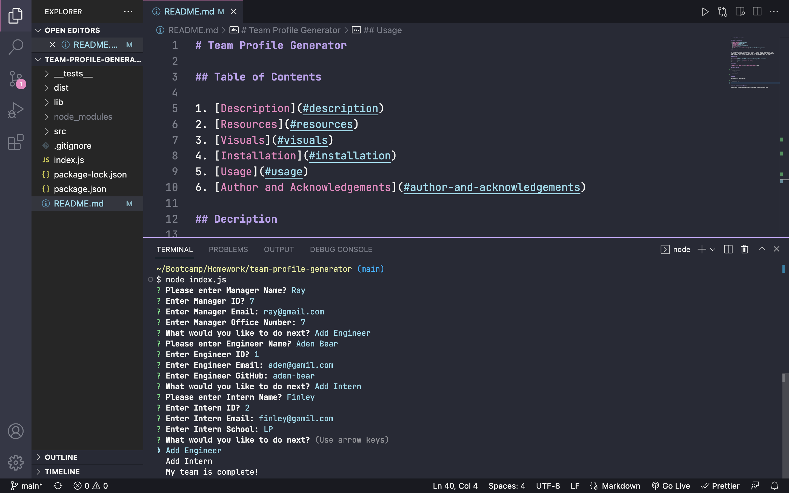

# Team Profile Generator

## Table of Contents

1. [Description](#description)
2. [Resources](#resources)
3. [Visuals](#visuals)
4. [Installation](#installation)
5. [Usage](#usage)
6. [Author and Acknowledgements](#author-and-acknowledgements)

## Decription

The assignement requires students to create a Node.js command-line application that takes in information about employees on a software engineering team and generates an HTML webpage that displays summaries for each person. Because testing is key to making code maintainable, studants must also write unit tests for each part of your code and ensure that it passes all of them.

## Resources

-[Repository](https://github.com/raydover/team-profile-generator)

-[Video Link](https://drive.google.com/file/d/1PSI5xMBjCKSoSVwfuLBvkbW1_fwZ9wmN/view)

## Visuals



## Installation

```
- node i inquirer
- node i fs
- node i jest 
```

## Usage

To launch this application:

```
- node index.js
```

## Author and Acknowledgements

code created by UNCC Bootcamp Coders, edited by Student Raymond Dover